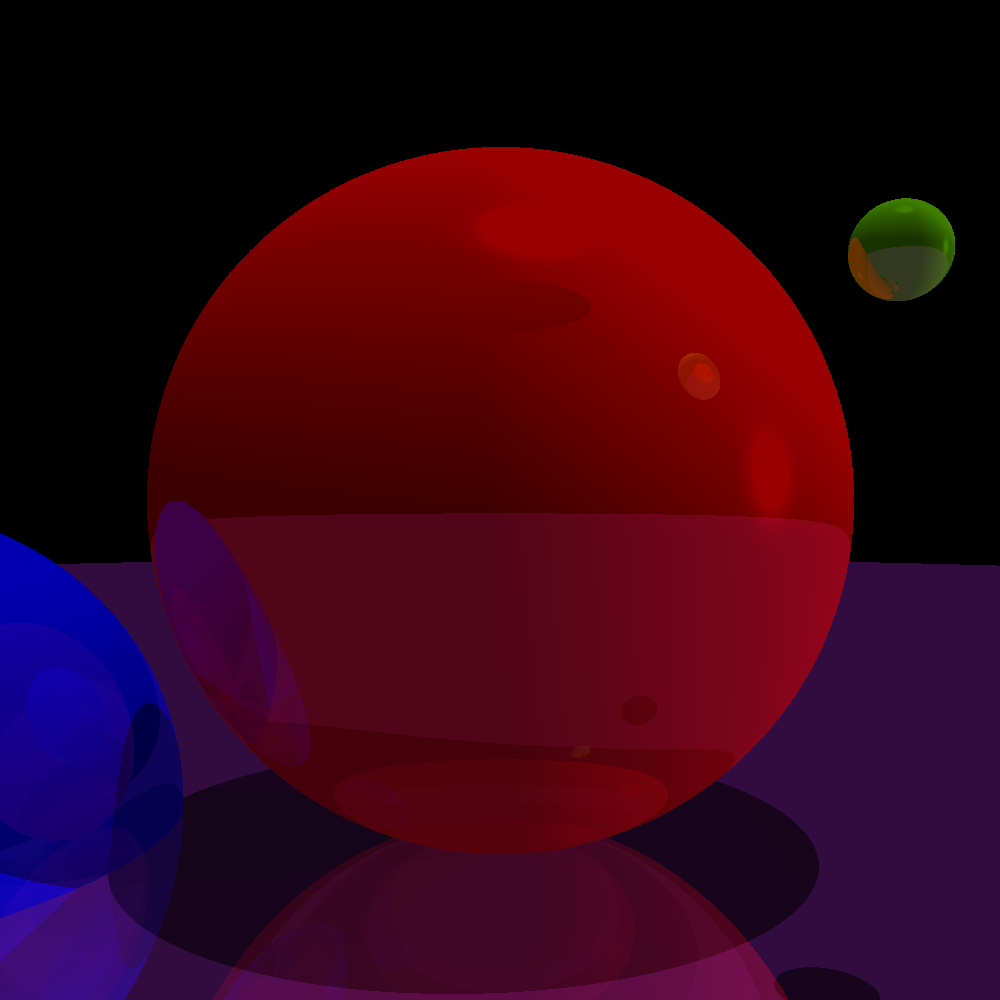

# Raytracing in Go

A simple 3D raytracing engine, purely as a learning exercise.

Features:

- Lighting (point, directional, ambient)
- Shadows
- Reflections (*n* levels)
- Object interface for theoretical support for any geometric object (currently supports Triangles, Boxes and Spheres)

## Example output

The image above was rendered with the example code in [examples/png/main.go](examples/png/main.go)

There's also a basic [terminal-based 3D game demo](examples/game/main.go).

## TODO

- [ ] Texturing

