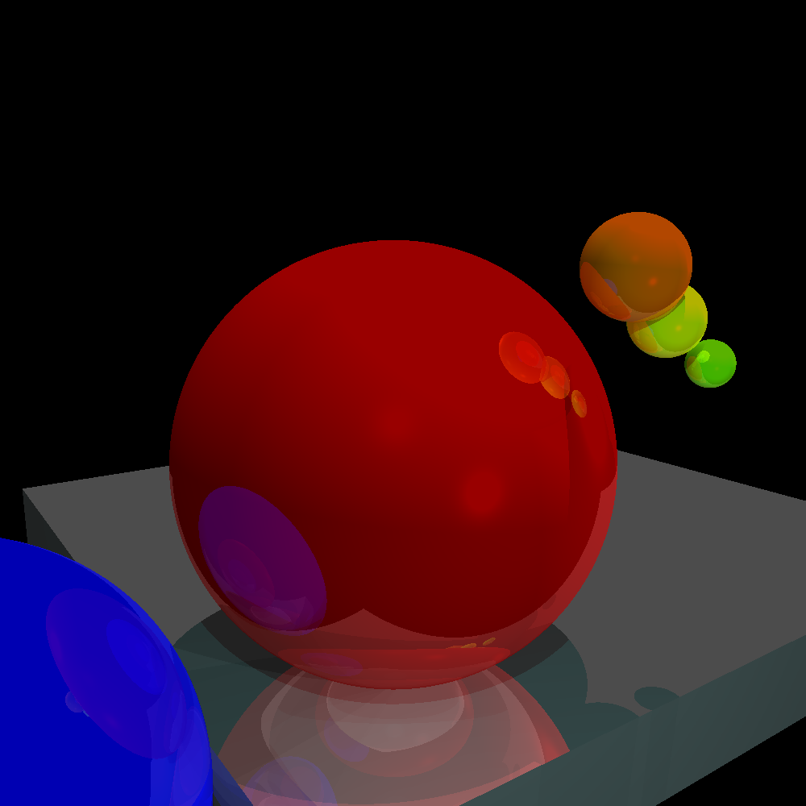

# Raytracing in Go

A simple 3D raytracing engine, purely as a learning exercise for now.

Features:

- Lighting (point, directional, ambient)
- Shadows
- Reflections (*n* levels)
- Object interface for theoretical support for any geometric object

## Example output



### Example Code

The image above is rendered with:

```
package main

import (
	"github.com/fogleman/gg"
	"github.com/liamg/raytracing/raytracer"
)

func main() {

	canvasSize := raytracer.Vector{X: 1000, Y: 1000}

	scene := raytracer.NewScene(canvasSize)
	scene.AddObject(raytracer.NewSphere(
		raytracer.Vector{X: 0, Y: 0, Z: 3},
		1,
		raytracer.Colour{R: 1, G: 0, B: 0},
		100,
		0.4,
	))
	scene.AddObject(raytracer.NewSphere(
		raytracer.Vector{X: -2, Y: 1, Z: 3},
		1,
		raytracer.Colour{R: 0, G: 0, B: 1},
		100,
		0.3,
	))
	scene.AddObject(raytracer.NewSphere(
		raytracer.Vector{X: 0.8, Y: -0.5, Z: 2},
		0.1,
		raytracer.Colour{R: 0.5, G: 1, B: 0},
		100,
		0.5,
	))
	scene.AddObject(raytracer.NewSphere(
		raytracer.Vector{X: 0.0, Y: 500, Z: 3},
		499,
		raytracer.Colour{R: 0.4, G: 0.1, B: 0.5},
		100,
		0.5,
	))

	scene.AddLight(raytracer.NewAmbientLight(raytracer.Colour{0.4, 0.4, 0.4}))
	scene.AddLight(raytracer.NewPointLight(raytracer.Colour{0.7, 0.7, 0.7}, raytracer.Vector{7, -70, 0}))
	scene.AddLight(raytracer.NewPointLight(raytracer.Colour{0.5, 0.5, 0.5}, raytracer.Vector{80, -7, 0}))

	dc := gg.NewContext(int(canvasSize.X), int(canvasSize.Y))

	origin := raytracer.Vector{}

	for x := -int(canvasSize.X) / 2; x < int(canvasSize.X)/2; x++ {
		for y := -int(canvasSize.Y) / 2; y < int(canvasSize.Y)/2; y++ {
			dest := scene.CanvasToViewport(raytracer.Vector{X: float64(x), Y: float64(y)})
			colour := scene.TraceRay(origin, dest, 1, 100, 4)
			dc.SetRGB(colour.R, colour.G, colour.B)
			dc.SetPixel(x+(int(canvasSize.X)/2), y+(int(canvasSize.Y)/2))
		}
	}

	dc.SavePNG("demo.png")
}

```

## TODO

- [ ] More object primitives (cubes etc.)
- [ ] Texturing

